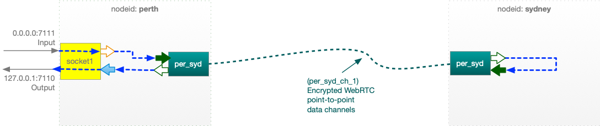
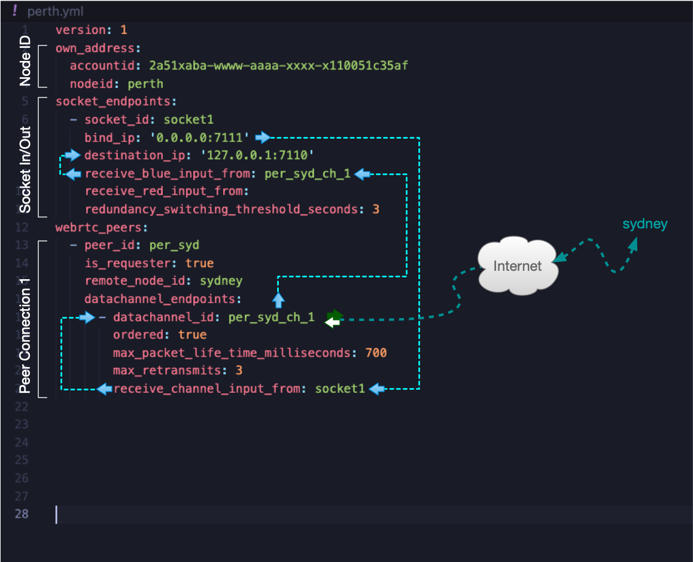
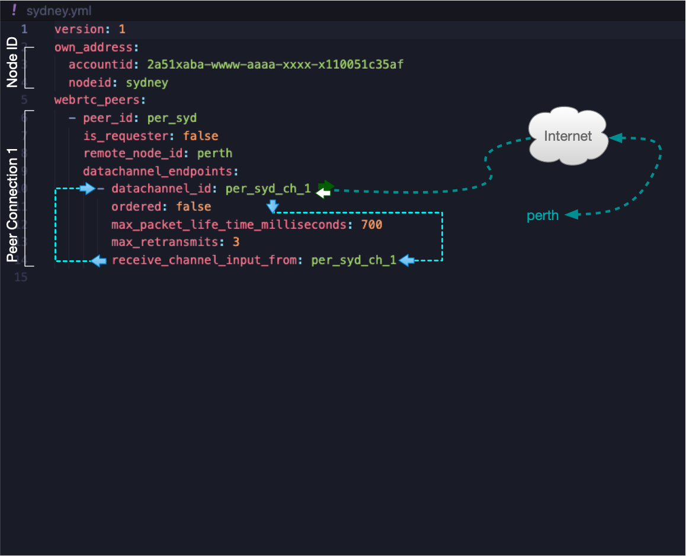

# A simple loop back example

Here you can find very simple point to point config with a loopback on one end that allows testing the UDP flow from one end of the path.
For a more useful configuration and more detailed description on how to configure lsfgateway, please see the [4 node config example](../4sites_protection_switching). 

## Input

## Remote Loop back

