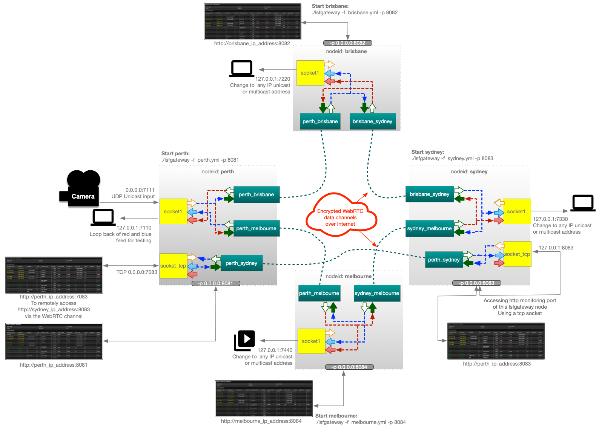
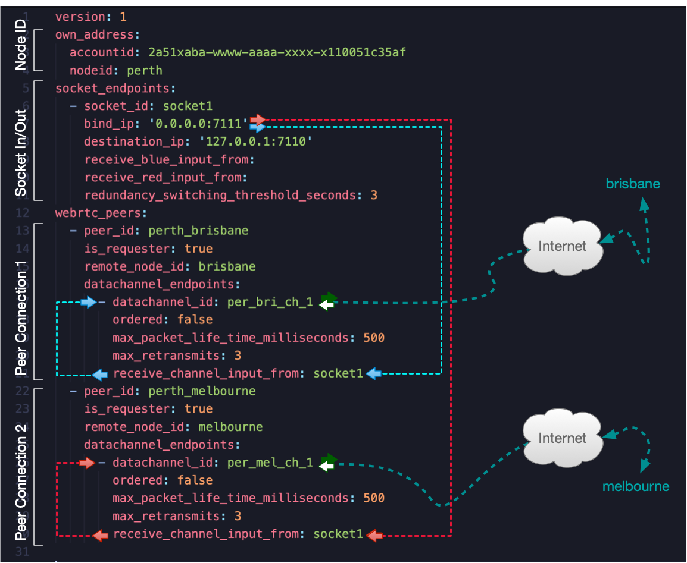
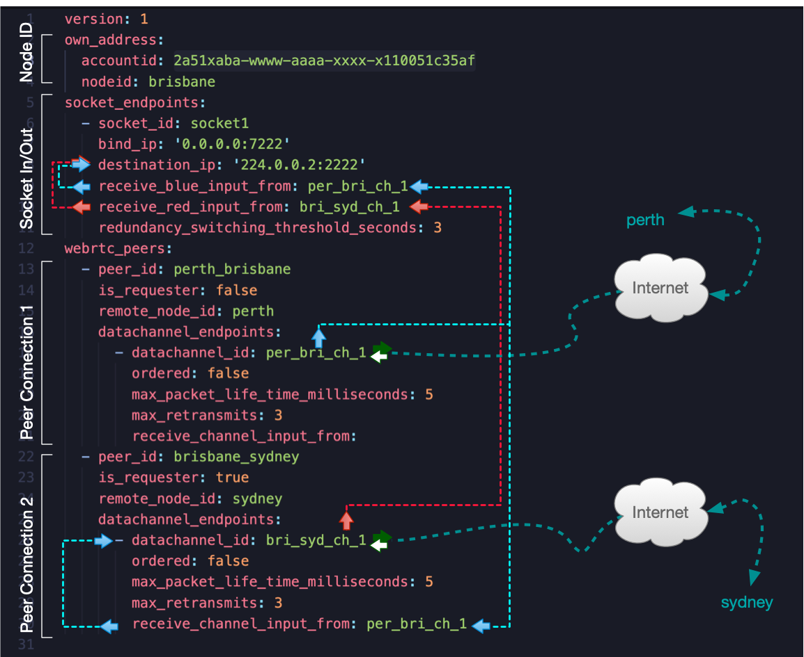
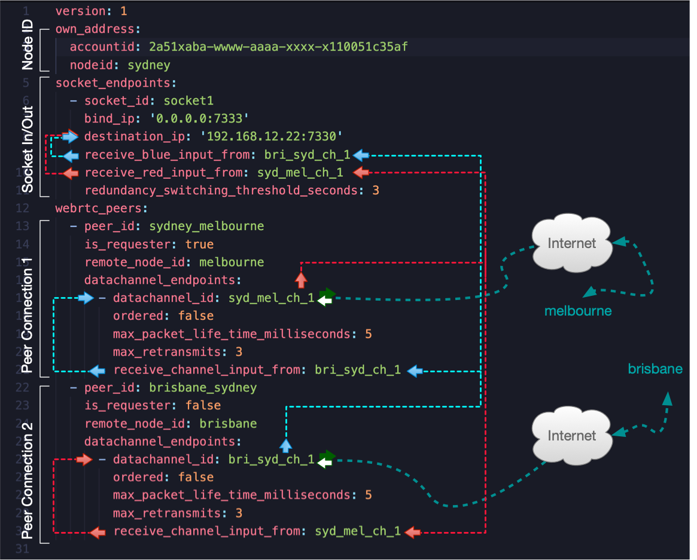
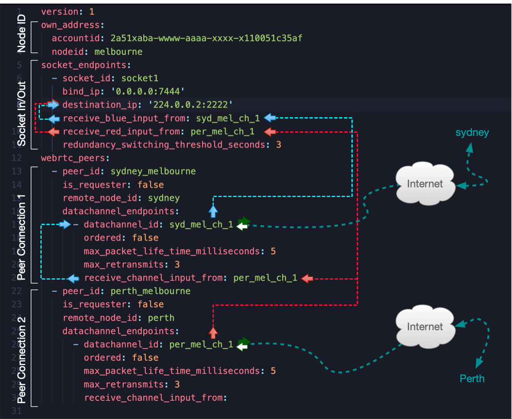

# A 4 site config example

A more advanced configuration set with 4 sites which shows how to configure point to multipoint paths with protection switching. Below follows a diagram with an overview of this example. 




## Instructions

The following sections explain each configuration element in detail.

### Insert Your Account ID into the Configuration File

#### Version

The `version` field is used to identify the version of the configuration file. Currently, only version 1 is available.

```yaml
version: 1
```

#### Identify the node

lsfgateway does not rely on IP addresses to connect nodes across the network. Instead, it uses node names. Therefore, each node must have a unique identifier within your account.

```yaml
own_address:
  accountid: 2a51xaba-wwww-aaaa-xxxx-x110051c35af
  nodeid: perth
```

### own_address:

This section creates an identity for the node. Nodes use this identity to discover each other over the internet.

#### accountid:

In the configuration file under the `own_address` section, replace the placeholder account ID with the **Account ID** you received in an email from **LiveStreamFleet.com** after purchase. This ID is unique and generated by the backend system. The account ID is also used to count against your active node quota, so keep it secret to prevent others from using your active node quota. If you believe your account ID is compromised, please raise a support ticket on our website to request a new one.

**Security note:** Only nodes with the same account ID can find and connect with each other. Nodes with different account IDs cannot establish connections over the internet.


#### nodeid:

The node ID is a unique name you choose to identify each node within your account. This ID is used to locate and establish WebRTC channels with other nodes over the internet.


### UDP and TCP Sockets

If you are using lsfgateway to send or receive data from the physical IP network, you'll need to configure a socket for every IP input and output.

The socket_endpoints section allows you to define the network interfaces for each node. Customize bind_ip to specify the local interface that listens for traffic and destination_ip to define where the node sends its traffic. Both unicast and multicast IP addresses are supported. If the input is a multicast IP address, the node will automatically join the multicast stream.

Below is an example configuration with three different sockets. The first one is an udp socket. The second one is a TCP listener/server port and the last one is a TCP client. 

```yaml
socket_endpoints:
  - socket_id: socket_udp
    bind_ip: '0.0.0.0:7111'
    destination_ip: '127.0.0.1:7110'
    receive_blue_input_from: 
    receive_red_input_from: 
  - socket_id: socket_tcp_server
    is_tcp: true
    bind_ip: '0.0.0.0:8080'
    destination_ip: 
    receive_blue_input_from: 
    receive_red_input_from: 
  - socket_id: socket_tcp_client
    bind_ip: 
    destination_ip: '127.0.0.1:9123'
    receive_blue_input_from: 
    receive_red_input_from: 
```


#### socket_id:

A unique identifier within the local configuration for the socket.

#### is_tcp:

This is an optional item and can be used when the socket type is TCP. The socket type is by default UDP but you can set is_tcp = true to enable TCP support. 

#### bind_ip:

The IP address and port number of the **input stream** from the physical network. If the socket type is UDP this IP address can be either a unicast or multicast IP address. 
If the socket type is TCP, this is the local listener address which replaces the remote server address. As an example, if we are using TCP for file transfer, this bind_ip address replaces the remote file transfer server such as the remote ftp server. A file transfer client connects to this bind_ip address for communication to the remote server. 

#### destination_ip: 

The IP address and port number of the **output stream** to the physical network. This can be either a unicast or multicast IP address when the socket type is UDP.
If the socket type is TCP, this is a client address is the IP address of the server that the clients need to connect to. In the file transfer example mentioned above, the IP address in the destination_ip is the actual file transfer server or FTP server address. 


### Internal flows and protection switching

The lsfgateway configuration supports defining multiple sockets and WebRTC data channels, enabling flexible internal data flows. You can manage how data flows into a specific socket by specifying input sources using receive_blue_input_from and receive_red_input_from.

- **Single Input:** If only one input (blue or red) is configured, data will flow exclusively from that source.
- **Bonded Inputs:** If both blue and red inputs are configured, lsfgateway uses bonding to select and output the packet that arrives first from either input, ensuring minimal delay.
- **Redundant Inputs:** In this mode, inputs can come from different sources, and the system will switch between them if one input fails to receive data within a configured time threshold. The switching threshold is defined by the parameter redundancy_switching_threshold_seconds.

- This design provides flexibility, performance, and resilience by allowing seamless transitions between inputs in various scenarios.

#### receive_blue_input_from:

This parameter specifies the ID of a socket or data channel as the primary input source.

#### receive_red_input_from:

This parameter specifies the secondary (protected) input source.

#### redundancy_switching_threshold_seconds:

This parameter defines the time (in seconds) the system waits before switching between blue and red inputs when one of them stops receiving data entirely. This only applies when the blue and red inputs originate from different sockets.

Range: 1 second to 60,000 seconds.
Recommendation:
**For constant flows** (e.g., video or audio streams), use a shorter threshold to ensure seamless transitions with minimal latency.
**For bursty traffic**, set a longer threshold to avoid unnecessary or frequent switching during temporary pauses.
Adjust this value based on the characteristics of your incoming data flow to balance responsiveness and stability.

### Rate Limiting Parameters

lsfgateway includes parameters to control the maximum data rate for both incoming and outgoing IP traffic to and from a socket. These parameters ensure that users are not overwhelmed by unexpected high-bandwidth content, which could potentially flood their network.

#### ip_in_max_rate_mbps

This parameter sets the maximum allowable data rate (in Mbps) for incoming traffic to a socket.

**Purpose:** Prevents excessive data from being received through the socket, safeguarding the network against unanticipated high-bandwidth streams.

**Example:** Setting ip_in_max_rate_mbps: 3 limits the incoming traffic rate to 3 Mbps, ensuring controlled data flow into the system.

#### ip_out_max_rate_mbps
This parameter defines the maximum data rate (in Mbps) for outgoing traffic from a socket.

**Purpose:** Ensures that the data sent out from the socket does not exceed the user’s expected bandwidth capacity, protecting the network from potential congestion caused by high outbound traffic.
**Example:** Setting ip_out_max_rate_mbps: 3 restricts the outgoing traffic rate to 3 Mbps, maintaining a predictable and manageable data flow.

### WebRTC Peers & Data Channels

lsfgateway nodes establish WebRTC data channels between each other to transport IP flows to and from sockets.

Below is an example configuration of the Perth node, which establishes data channels to Brisbane and Melbourne:

```yaml
webrtc_peers:
  - peer_id: perth_brisbane
    is_requester: true
    remote_node_id: brisbane
    datachannel_endpoints:
      - datachannel_id: per_bri_ch_1
        ordered: false
        max_packet_life_time_milliseconds: 500
        max_retransmits: 3
        receive_channel_input_from: socket1
  - peer_id: perth_melbourne
    is_requester: true
    remote_node_id: melbourne
    datachannel_endpoints:
      - datachannel_id: per_mel_ch_1
        ordered: false
        max_packet_life_time_milliseconds: 500
        max_retransmits: 3
        receive_channel_input_from: socket1
```

#### webrtc_peers:

The top-level list containing WebRTC peer connections.

#### peer_id: 

A unique ID for the peer connection between two nodes.

**Security note:** The peer_id must be identical in the configuration files of both nodes. lsfgateway will refuse the data channel connection if the peer_id is not identical on both ends.

#### is_requester:

In WebRTC, one node must request the connection. If **is_requester** is true, the node initiates the connection. If false, the node will only accept connection requests from the remote_node_id with matching **peer_id** and **accountid**.

#### remote_node_id:

The nodeid of the remote node that will connect to this peer. The remote_node_id must be identical to the node if of the remote node for the connection to be established.

#### datachannel_endpoints: 

You can establish more than one data channel within a single peer connection if required.

#### datachannel_id:

A unique name for the data channel. This must be unique within the configuration file.

#### ordered:

WebRTC **ordered** data channels are a feature of WebRTC that ensures the transmission of messages in the exact order they were sent, providing a reliable communication channel between peers. In ordered data channels, messages are **received in sequence**, with no loss or reordering, which is useful for applications where the order of data is critical, such as file transfers or real-time collaborative tools. This is achieved using underlying protocols like SCTP (Stream Control Transmission Protocol), which handles retransmissions in case of data loss to preserve the order. However, o**rdered data channels can introduce slight delays** compared to unordered ones due to these retransmissions, making them more suitable for use cases where data integrity and order are prioritized over speed.

#### max_packet_life_time_milliseconds:

This is used to configure WebRTC's **maxPacketLifeTime** property. the value is a number in milliseconds. This setting applies **only when ordered delivery is not enforced**, meaning it's commonly used with unordered data channels where timing is prioritized over strict data order.

The maxPacketLifeTime setting in WebRTC data channels specifies the maximum amount of time, in milliseconds, that a packet can be delayed before being discarded. This parameter is particularly useful for real-time applications where timely delivery of data is more important than ensuring every packet arrives, such as in gaming, video conferencing, or live streaming. If a packet cannot be delivered within the specified time, it is dropped rather than being retransmitted, helping to avoid congestion and ensuring that stale data doesn't slow down real-time interactions. You can use it to fine-tune the balance between reliability and latency, tailoring the communication experience to the needs of the specific application.

#### max_retransmits:

This is used to configure WebRTC's **maxRetransmits** property. the value is a number. This setting applies to both ordered and unordered WebRTC data channels.

The maxRetransmits setting in WebRTC data channels limits the number of times a message is retransmitted if it fails to reach its destination. This setting allows to control how persistent the system should be in trying to deliver each packet before giving up. It is particularly useful for applications that need reliable delivery but can tolerate some packet loss to maintain performance, like multiplayer games or non-critical real-time data sharing.

If a message cannot be successfully sent after the specified number of retries, it will be dropped. This helps prevent excessive delays that could degrade user experience in latency-sensitive applications. maxRetransmits works hand-in-hand with the reliability features of WebRTC's underlying protocol (SCTP), allowing developers to adjust the trade-off between reliability and latency depending on their application's needs.

#### receive_channel_input_from:

The ID of a socket or data channel in the configuration. This flow will be transported over the data channel to the remote node.


## Internal Data Flows

As mentioned, lsfgateway provides a unique way to define internal data flows using the following variables:

- **receive_channel_input_from**: used by datachannels
- **receive_blue_input_from**: the main dataflow in to a socket
- **receive_red_input_from**: the optional redundant dataflow in to a socket 

Below are diagrams showing how data flows are configured in this 4-node setup. The images display configuration files for Perth, Brisbane, Sydney, and Melbourne nodes.

#### Perth

In this example, the Perth node sends the input UDP feed over blue and red paths to the other three nodes. 



#### Brisbane

Brisbane drops off the UDP stream and forwards it to Sydney.



#### Sydney

Sydney drops off both red and blue streams and forwards them to the next sites.



#### Melbourne

Melbourne's configuration is very similar to Brisbane.




## What to test

You can set the 4 nodes up on 4 different PCs at 4 different locations. It is fine to have the nodes behind firewalls, as far as protection switching is concerned.

For protection switching, the redundancy_switching_threshold_seconds parameter controls the failover time between paths (e.g., between blue and red inputs).

 
## Firewall Considerations

lsfgateway nodes use **WebRTC data channels**, which typically work behind firewalls. However, in highly restrictive firewall environments or with specific UDP traffic blocking, connections may fail. Complex network configurations, like symmetric NATs, may also pose challenges. If the WebRTC connection cannot be established, data channels may drop or fail.
 

## Running lsfgateway with the config files

Place your YAML configuration file (e.g., perth.yaml, sydney.yaml) in the same directory as the lsfgateway binary or another accessible location on your system. Start each node by running the following command:


## Remote monitoring: 

You can use an lsfgateway node to output statistics and events from other nodes. Alternatively, you can start a new instance dedicated to monitoring.

### Start a monitoring node:

The monitoring node only requires your account ID and a unique name, like monitoring. See the `monitoring.yaml` example.

Start a monitoring node with the following command:

Start a monitoring node: 
```sh
# Start the monitoring node on a computer.
lsfgateway -f monitoring.yml
```

Send the output from any other remote node to the the monitoring node simple by using `-m nameid_of_the_monitoring_node`. Example: 

```sh
# let your nodes send their output remotly to the monitoring device:
./lsfgateway -f perth.yml -m monitoring
```


## Optional - For added security

To enhance security, consider creating a dedicated system group and user to run the lsfgateway process. Restrict their permissions to prevent modification of roles or privileges.

lsfgateway instances only need access to their own config file and the network interfaces to send and receive data between sockets and WebRTC data channels.

## Optional - Run as background service

If you like to run lsfgateway as a backgroundservice, follow the instructions in [this document](../other_docs/run_as_background_service.md). 


